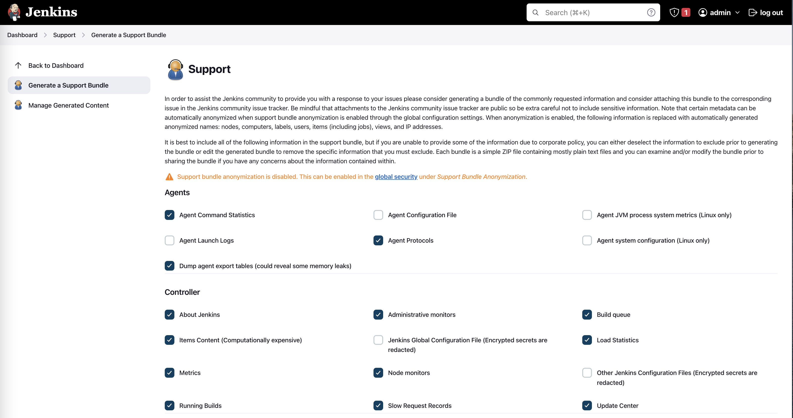

# Support Core Plugin

[](https://ci.jenkins.io/job/Plugins/job/support-core-plugin/job/master/)
[](https://plugins.jenkins.io/support-core)

## Introduction

The plugin provides the basic infrastructure for generating "bundles" of
support information within Jenkins.

There are three ways of generating bundles:

-   Automatic bundles, these get saved in $JENKINS\_HOME/support once
    per hour starting 3 minutes after Jenkins starts the plugin (i.e.
    this may still be generated even if Jenkins will not fully start).
    The automatic bundles are retained using an exponential aging
    strategy, so you should have a bunch of them over the entire
    lifetime once the plugin has been installed.
-   On demand bundles:
    -   You can generate them from the root "Support" action, using the
        User Interface ; or
    -   By using the CLI Command. For the association documentation,
        please refer to `<yourJenkinsInstanceUrl>/cli/command/support`
        embedded documentation.



## Docker File

As part of the support bundle if the About Jenkins option is checked
then you will receive a docker file in the bundle also. The docker file
contains the current version of Jenkins, along with a wget operation to
download all of the plugins on the Jenkins master. This creates a
similar environment for testing or reproducing bugs.

First build the image:

    docker build -f Dockerfile

then run the docker image

    docker run -d -p 8080:80

This should create a new Jenkins master with the same version, and the
same plugins and versions all bundled.

## Third party support providers

Various companies and organizations provide commercial support for
Jenkins. They can provide additional content and branding to the support
action. The following lists the known third party support providers (in
date order) and the links to their support provider plugin.

-   [CloudBees Support
    Plugin](https://release-notes.cloudbees.com/product/CloudBees+Support+Plugin) by
    [CloudBees, Inc.](https://www.cloudbees.com)

## Frequent issues

### Support bundles corrupt through the UI

The most common situation for this to happen is when the **About
Jenkins** option is enabled.

Meanwhile, the support bundle is getting generated it looks like the
generation process is stuck as the downloaded size stays at the same
point for a long time. To diagnosis this issue the best is to take a
threadDump when in the moment where it is stuck and check the Jenkins
logs.

If a stacktrace like the one below appears

```
"Handling POST /support/download from XX.XX.XX.XX : RequestHandlerThread[#126]" Id=123772 Group=main RUNNABLE
    at java.io.UnixFileSystem.getBooleanAttributes0(Native Method)
    at java.io.UnixFileSystem.getBooleanAttributes(UnixFileSystem.java:242)
    at java.io.File.isDirectory(File.java:849)
    at com.cloudbees.jenkins.support.impl.AboutJenkins$ItemsContent.printTo(AboutJenkins.java:641)
    at com.cloudbees.jenkins.support.api.PrintedContent.writeTo(PrintedContent.java:47)
    at com.cloudbees.jenkins.support.SupportPlugin.writeBundle(SupportPlugin.java:359)
    at com.cloudbees.jenkins.support.SupportAction.doDownload(SupportAction.java:154)
```

and the Jenkins logs are populated with 

```
2018-01-04 04:52:17.633+0000 [id=123769] WARNING c.c.j.support.SupportPlugin#writeBundle: Could not attach 'nodes/slave/agent1/checksums.md5' to support bundle
org.eclipse.jetty.io.EofException: Closed
    at org.eclipse.jetty.server.HttpOutput.write(HttpOutput.java:476)
    at net.bull.javamelody.FilterServletOutputStream.write(FilterServletOutputStream.java:88)
    at net.bull.javamelody.CounterResponseStream.write(CounterResponseStream.java:82)
    at org.apache.tools.zip.ZipOutputStream.writeOut(ZipOutputStream.java:1029)
    at org.apache.tools.zip.ZipOutputStream.deflate(ZipOutputStream.java:680)
    at org.apache.tools.zip.ZipOutputStream.closeEntry(ZipOutputStream.java:432)
    at org.apache.tools.zip.ZipOutputStream.putNextEntry(ZipOutputStream.java:489)
    at com.cloudbees.jenkins.support.SupportPlugin.writeBundle(SupportPlugin.java:358)
    at com.cloudbees.jenkins.support.SupportAction.doDownload(SupportAction.java:154)
```

Then, surely the problem is that you are hitting the **Idle timeout** in
the load balancer and this makes the connection betweek the ELB and your
broweser to drop. To workaround this problem you can:

-   Increase the Idle timeout in the load balancer
-   Not include About Jenkins section
-   Reduce the number of builds in the system

## Support Bundle Anonymization

[Beginning in version
2.48](https://issues.jenkins-ci.org/browse/JENKINS-21670),
this plugin now allows for automated `ContentFilter` extensions to
enable anonymizing of various data. By enabling this feature, the
default set of filters will anonymize agent names, agent computer names,
agent labels, view names (aka folders), job names, usernames, and IP
addresses (both IPv4 and IPv6). These data are mapped to randomly
generated fake names which are saved to Jenkins master. A Jenkins
administrator can view these mappings by going to **Manage Jenkins** **›>
Support Bundle Anonymization**. All files written to the support bundle
by this and all extensions of this plugin will replace all instances of
the original values with their anonymized counterpart. Note that the
Stop Words list on that page shows which terms are ignored when
filtering names (case-insensitive full match).

### Limitations

Anonymization filters only apply to text files. It cannot handle
non-Jenkins URLs, custom proprietary Jenkins plugin names, and
exceptions quoting invalid Groovy code in a Jenkins pipeline. The active
plugins, disabled plugins, failed plugins, and `Dockerfile` reports are
not anonymized due to several Jenkins plugins and other Java libraries
using version numbers that are indistinguishable from IP addresses.
These reports are in the
files `plugins/active.txt`, `plugins/disabled.txt`, `plugins/failed.txt`,
and `docker/Dockerfile`. These files should all be manually reviewed if
you do not wish to disclose the names of custom proprietary plugins.

## <a name="casc"></a>Configuration as Code

As of 2.68 version, support-core is compatible with [Jenkins Configuration as Code](https://github.com/jenkinsci/configuration-as-code-plugin) (CasC).

The configuration looks like:

```
security:
  anonymizeSupportBundle:
    enabled: true
```
It enables (_true_) or disables (_false_) the anonymization of the bundle.

Previous versions of this plugin could be configured by CasC as well, but the configuration was so:

```
unclassified:
  contentFilters:
    enabled: false
```
This version changes the configuration fields to be more intuitive. Please update your yaml file if
you update support-core to version 2.68 or later.
